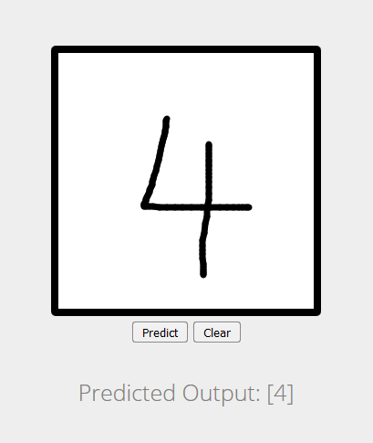

# MNIST Flask App

This code is based on: https://github.com/sleepokay/mnist-flask-app

A [Flask](http://flask.pocoo.org/) web app for handwritten digit recognition using a convolutional neural network. The model was trained on the MNIST dataset in [TensorFlow](https://www.tensorflow.org/) using the [Keras API](https://github.com/fchollet/keras). 
